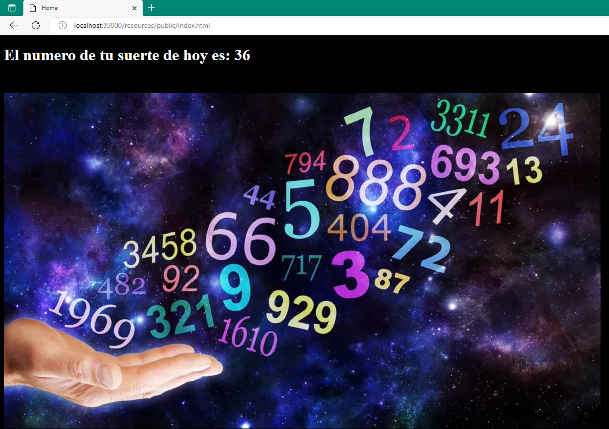
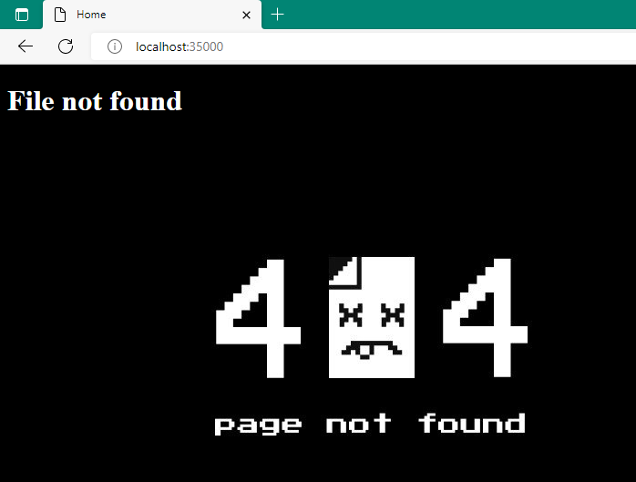
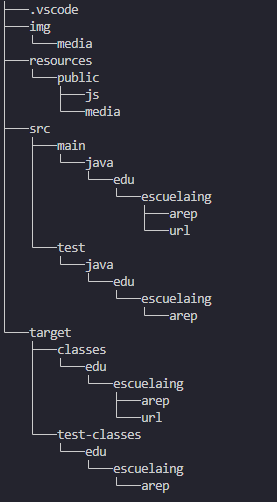

# TALLER CLIENTES Y SERVICIOS
## AREP-1
### Diego Leon [diegoleonb](https://github.com/diegoleonb)
#### 2022-2

Este taller presenta diferentes retos que los ayudarán a explorar los conceptos de esquemas de nombres y de clientes y servicios. Adicionalmente, el taller le ayudará a explorar la arquitectura de las aplicaciones distribuidas sobre internet.

Se implementa unicamente el RETO 1

Aqui se muestra un ejemplo de su uso:



En caso de no encontrarse el recurso se le muestra al usuario pagina de error:




Si desea utilizar la app puede dirigirse al siguiente enlace de Heroku:

```
http://clientesyservicios.herokuapp.com/resources/public/index.html
```

Si desea dirigirse automaticamente dele click [clientesYservicios](http://clientesyservicios.herokuapp.com/resources/public/index.html)

## Tree




## Requisitos para correr el programa (Por medio de localhost)

- [Java](https://www.java.com/es/download/)
- [Maven](https://maven.apache.org/download.cgi)
  
## Como correr el servidor web:

Compilar: 

```
mvn package
```
Ejecutarlo:

```
java -cp target/classes:target/dependency/* edu.escuelaing.arep.EchoServerMain
```

En caso de estar en Windows hay que cambiar los dos puntos por punto y coma (: -> ;):

```
java -cp target/classes;target/dependency/* edu.escuelaing.arep.EchoServerMain
```

## Documentacion

```
mvn javadoc:javadoc
```

La documentacion se guarda en la ruta: target\site\apidocs\index.html

O puede acceder a la misma directamente [documentacion](/target/site/apidocs/index.html)


## Licencia

[LICENCIA](License.txt)


